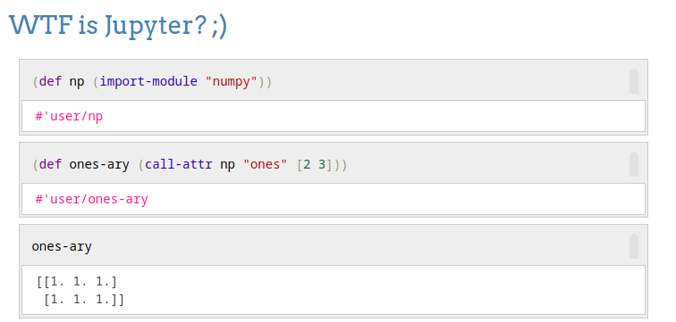

## [](https://github.com/pink-gorilla/gorilla-notebook/actions?workflow=CI)[](https://clojars.org/org.pinkgorilla/gorilla-notebook)



Pink Gorilla Notebook is a browser based notebook REPL for Clojure and ClojureScript. We aim at a small core application with a high level of runtime extensibility and great user experience. Extensibility primarily revolves around visualisation, widgets and data.

Use cases we are trying to cover include
- Data science
- Persistent experiments and demos (Clojure/ClojureScript libraries)
- Courses and education on all matters related to clojure
- Pluggable JEE webapp instrumentation

We use various libraries and also borrow from alien ecosystems (Python and R).


## Status (January 2020)
You can probably imagine that ideas come up way faster than you can explore them. So far, we were
 primarily focused on cleaning up and building a solid foundation for the future. Basic building
  blocks to move fast and safe (Tests, CI/CD, Code Quality Tooling) are in place and we caught up with
  recent versions of the things we use:

- Clojure/ClojureScript
- Shadow CLJS
- Jetty/Ring
- Tailwind
- React/Reagent/Reframe
- Cider
- Karma

However, not everything is :rainbow: yet. There is yak to shave and some things are still missing or rough:

- Tests
- Ring/Secretary
- Re-frame
- Styling :nail_care:
- Dependency hell :fire:
- ClojureScript Kernel

## FAQ
### Is Gorilla Notebook ready for day to day use?
The future is uncertain, but we are not aware of any technical issues which should be holding back users.

### What about migration from Gorilla REPL?
Being a decendant from [Gorilla REPL](http://gorilla-repl.org) we aim at a smooth migration path for the brave and also remain backwards
 compatible. Given the nature of Reagent, this did not appear to make sense with regards to persisted html. We ended up introducing version 2
  persistence (transit based) while still supporting version 1 (shamelessly discarding output). Other than that,
  URLs have slightly changed. The viewer is at `.../worksheet.html#/view` now. You may want to try
 [here](http://localhost:9000/worksheet.html#/view?source=github&user=JonyEpsilon&repo=gorilla-test&path=ws/graph-examples.clj)
 in case you have it running at port `9000`.


## Extensibility

We try to keep the code shipping with the bare notebook application minimal and aim at runtime customization where
 possible. The application (Jar/Uberjar/Docker Image) ships two flavors:

- `:advanced` optimization without ClojureScript kernel support
- `:none` optimization with ClojureScript kernel support and runtime extensibility

We support JVM library (`pomegranate`)-, ClojureScript- and JavaScript (`requirejs`) extensibility at runtime.

## Running Gorilla Notebook

### Via clojure / clojars

The easiest way to run releases locally is leveraging the `clojure` cli
```
clojure -Sdeps '{:deps {org.pinkgorilla/gorilla-notebook {:mvn/version "0.4.6"}}}' -m pinkgorilla.core
```
You'll get available command line options appending `--help`:
```
clojure -Sdeps '{:deps {org.pinkgorilla/gorilla-notebook {:mvn/version "0.4.6"}}}' -m pinkgorilla.core --help
```
so
```
clojure -Sdeps '{:deps {org.pinkgorilla/gorilla-notebook {:mvn/version "0.4.6"}}}' -m pinkgorilla.core -P 9111
```
will start up the HTTP server at port 9111.

### Via Docker Image

Alternatively, you can use the Clojure Docker image:
```
docker run -p 9000:9000 -v `pwd`/.m2:/root/.m2:rw -v `pwd`/notebooks:/tmp/notebooks:rw --rm clojure:tools-deps clojure -Sdeps '{:deps {org.pinkgorilla/gorilla-notebook {:mvn/version "0.4.6"}}}' -m pinkgorilla.core
```
You may want to use bind mounts to retain your work and to prevent downloading half of the internet.

We also provide uberjar Docker images which can be run as follows:
```
docker run --rm -p 9000:9000 pinkgorillawb/gorilla-notebook:latest
```

If you aim at running a Docker image built on demand from git by [ctr.run](ctr.run) (which is awesome) you can
```
docker run -p 9000:9000 -v `pwd`/.m2:/root/.m2:rw ctr.run/github.com/pink-gorilla/gorilla-notebook:a-branch-name gorilla-notebook.sh -c /root/.m2/custom.edn
```

But you are of course free to build the image yourself:

```
docker build --rm -t me/gorilla-notebook:builder .
```

If you want some samples to play with, you may want to clone and mount the samples repo into the container:

```
git clone https://github.com/pink-gorilla/sample-notebooks
docker run --rm -p 9000:9000 -v `pwd`/sample-notebooks/samples:/work/sample-notebooks:rw pinkgorillawb/gorilla-notebook:latest
```
### Locally from source

Install `npm` dependencies:
```
npm install
```

The following should then get you the uberjar:
```
./script/build-uberjar.sh
```
The uberjar is what the Docker image uses. It can be run by executing

```
java -jar target/gorilla-notebook-standalone.jar
```

The uberjar may also work by just dropping it into another webapp (in `WEB-INF/lib`) . Whether you are lucky
 or not depends on the dependencies of your app. If all goes well, Pink Gorilla will appear at
`.../your-app-context/gorilla-repl/worksheet.html`.

```
./script/build-uberwar.sh
```
should give you the standalone war file. Drop it into your servlet container and visit the root url of the webapp.

### Development

```
lein build-tailwind-dev
./script/run-repls-with-jpda.sh
```

builds css and spins up the webserver and a Shadow CLJS build with JPDA debugging. NREPL should be serving you Clojure and ClojureScript at port `8703`.

### Web Interface
Whichever method you use to start application, you should reach it at [`http://localhost:9000/worksheet.html`](http://localhost:9000/worksheet.html).

This source comes with various [test notebooks](https://github.com/pink-gorilla/gorilla-notebook/notebooks/) to try and the explorer should have some more. Some of them have known issues (hopefully indicated).

Finally, there is a bunch of aliases in `project.clj` you might want to check. Try

```
lein help
```

### As a library
Add a dependency in your project and tweak dependencies until things work. This is
 what I did (2017) with [lambdalf](https://github.com/deas/lambdalf). Again, if things go well,
 Pink Gorilla will appear at `.../your-app-context/gorilla-repl/worksheet.html`.

## Tests

[This is how we do it](https://github.com/pink-gorilla/gorilla-notebook/blob/master/.github/workflows/ci.yml)


## Contributing

Contribution of pretty much any kind is welcome. Feel free to get in touch. We are on [Clojurians Slack](http://clojurians.net/)
and also on [Clojurians Zulip](https://clojurians.zulipchat.com/#narrow/stream/212578-pink-gorilla-dev).

## History

In 2016, Andreas was working on the [first iteration of Gorilla REPL modernisation](https://www.contentreich.de/pimping-gorilla-repl-with-react-clojurescript-and-beyond). Amongst other
  things, [Reagent](http://reagent-project.github.io/) was introduced at that time. Unfortunately, it went silent -
  for almost three years. [This issue](https://github.com/pink-gorilla/gorilla-notebook/issues/2) revived the project.
